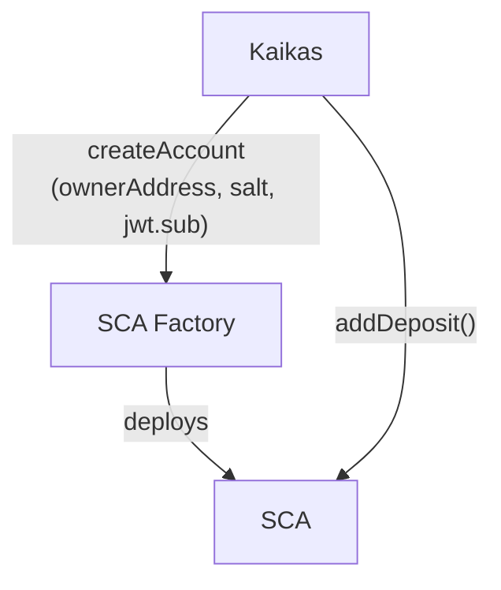
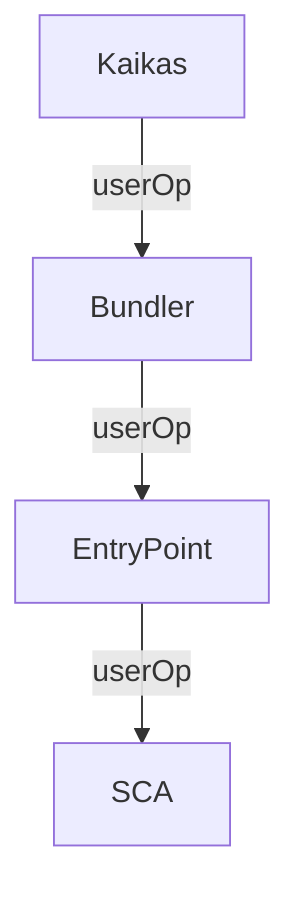
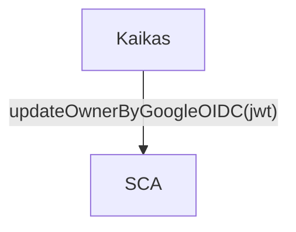

# Design

Integration with Kaikas

## Account setup

```mermaid
flowchart
	kk[Kaikas]
	sca[SCA]
	fac[SCA Factory]

	kk -- "createAccount\n(ownerAddress, salt, jwt.sub)" --> fac
	fac -- "deploys" --> sca
	kk -- "addDeposit()" --> sca
```

## Send UserOp

```mermaid
flowchart
	kk[Kaikas]
	ep[EntryPoint]
	sca[SCA]
	bundler[Bundler]

	kk -- "userOp" --> bundler
	bundler -- "userOp" --> ep
	ep --"userOp"--> sca
```

## Recovery

```mermaid
flowchart
	kk[Kaikas]
	sca[SCA]

	kk -- "updateOwnerByGoogleOIDC(jwt)" --> sca
```
