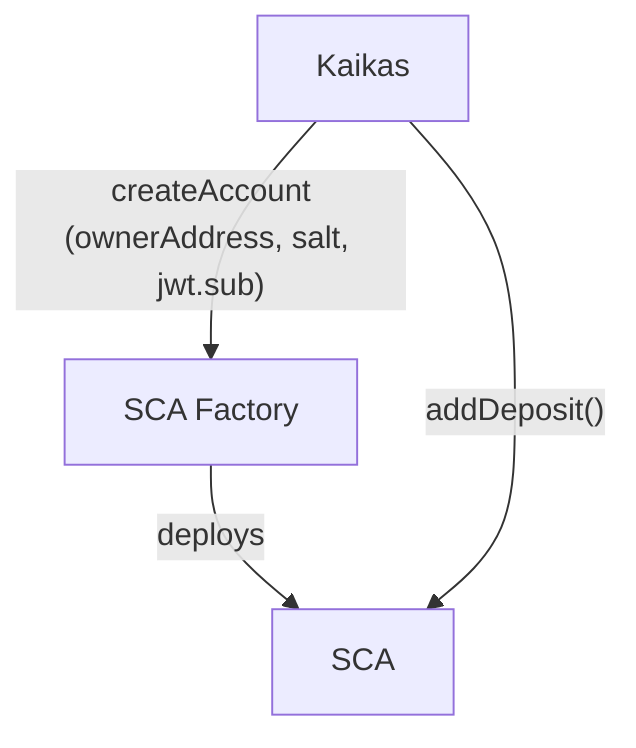

# aa-social

ERC-4337 login contracts for OAuth recovery

See [DESIGN.md](./DESIGN.md) for design.

# Localhost

## Run a localhost network

```
npx hardhat node --tags localhost
```

## Setup SCA

### Create SCA

```
JWT=$(npx hardhat genjwt --nonce 0 --network localhost)
npx hardhat create-account --jwt $JWT --network localhost
```

Output:

```
sca deployed to 0xcd7D8013c3D342Ae2BD274c2549C49A3a68c33A7
owner: 0xf39Fd6e51aad88F6F4ce6aB8827279cffFb92266
```

Check information of the deployed SCA:

```
npx hardhat sca-account --addr 0xcd7D8013c3D342Ae2BD274c2549C49A3a68c33A7 --network localhost
```

Output:

```
* sca: 0xcd7D8013c3D342Ae2BD274c2549C49A3a68c33A7
* sca.owner: 0x70997970C51812dc3A010C7d01b50e0d17dc79C8
* deposit: 0.00ether
* sub: 248289761001
* recoveryNonce: 0
```

If you forgot the sca address, give jwt instead to infer the address:

```
npx hardhat sca-account --jwt $JWT --network localhost
```

### Deposit

```
hh deposit --addr 0xcd7D8013c3D342Ae2BD274c2549C49A3a68c33A7 --network localhost
```

Check the deposit amount via `sca-account` task.



## Send UserOp (No bundler)

```
npx hardhat send-userop --addr 0xcd7D8013c3D342Ae2BD274c2549C49A3a68c33A7 --network localhost
```

Output:

```
counter.number before tx BigNumber { value: "0" }
counter.number after tx BigNumber { value: "1" }
```

## Recovery

```
hh recover --addr 0xcd7D8013c3D342Ae2BD274c2549C49A3a68c33A7 --jwt $JWT --network localhost
```

Output:

```
sca owner before tx 0xf39Fd6e51aad88F6F4ce6aB8827279cffFb92266
sca owner after tx 0x70997970C51812dc3A010C7d01b50e0d17dc79C8
```

# Mumbai

## Prerequisites

Two accounts and RPC endpoint are required:

```
cat .env
MUMBAI_URL="https://polygon-mumbai.g.alchemy.com/v2/[API_KEY]"
PRIVATE_KEY=0x1234
NEW_PRIVATE_KEY=0x5678
```

Check the two accounts are set

```
npx hardhat accounts --network mumbai
```

Output:

```
0xBeBe3506E02c6EA2039B48cEb462Da6F7AfE6a89 0.588129131632171495
0x47a945D6FaAad8512Cd10432FDf98b5A862DaC10 0.5
```

`EntryPoint`, `NonZKGoogleAccountFactory`, and `Counter` are already deployed:

```
EntryPoint: 0x5FF137D4b0FDCD49DcA30c7CF57E578a026d2789
NonZKGoogleAccountFactory: 0x9ca5CdB44F932DFb7711f1E8DBB2f35c7c3081e5
Counter: 0xa2688D6555F42b3A5131408Da66dE1409b7db87D
```

The rest steps are the same. If you'd like to try bundler, give `--bundler` flag:

```
npx hardhat send-userop --addr 0xcd7D8013c3D342Ae2BD274c2549C49A3a68c33A7 --network mumbai --bundler
```
